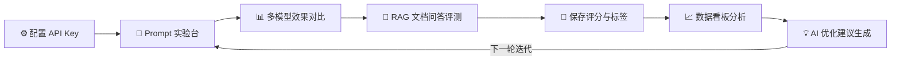
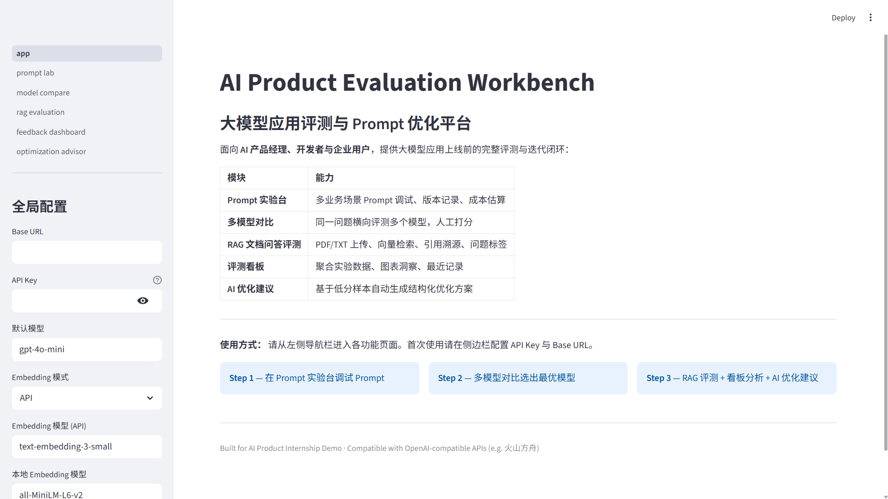
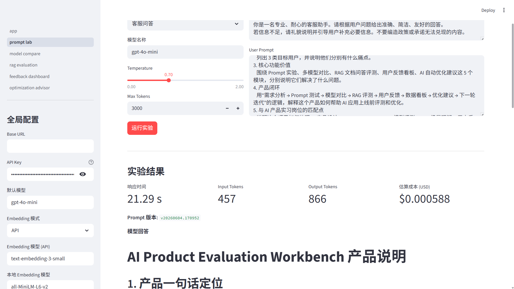
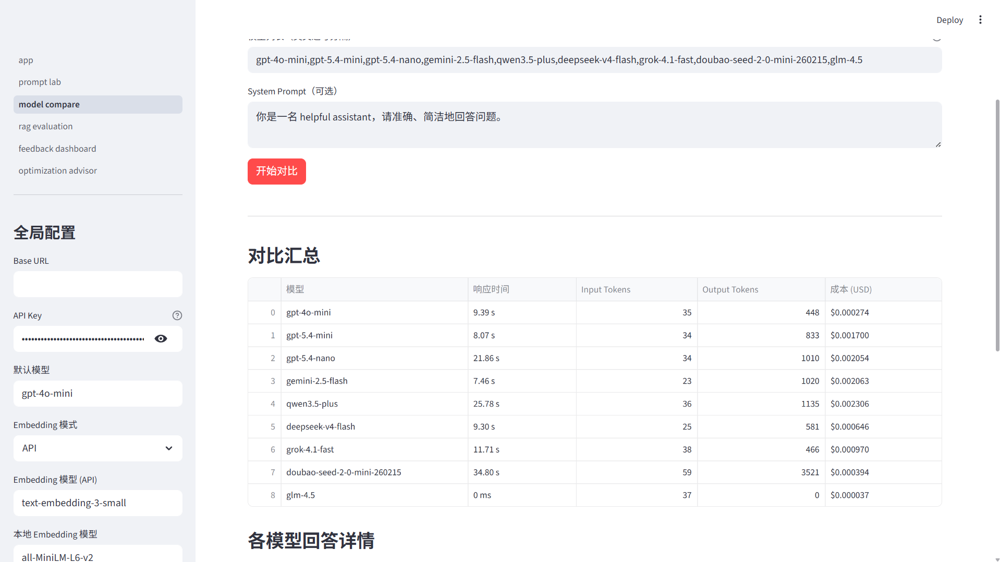
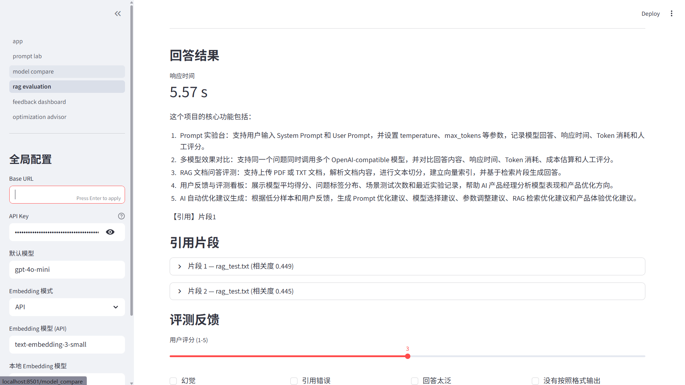
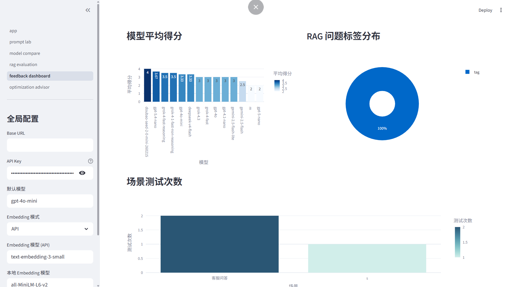
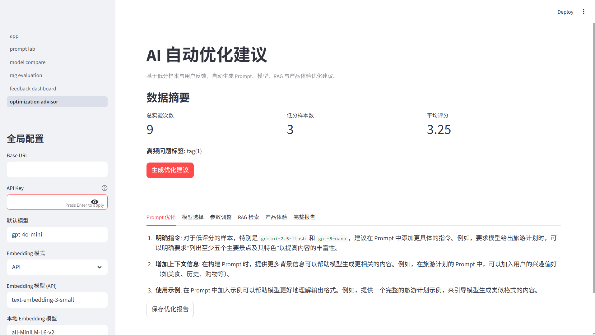

<div align="center">

# AI Product Evaluation Workbench

**大模型应用评测与 Prompt 优化平台**

Streamlit · SQLite · OpenAI-Compatible API · ChromaDB · Prompt Evaluation · RAG Evaluation


</div>

---

## 1. 项目简介

**AI Product Evaluation Workbench** 是一个面向 AI 产品经理、大模型开发者和企业 AI 团队的大模型应用评测平台。它以 Streamlit 为前端，将 Prompt 调试、多模型横向对比、RAG 文档问答评测、用户反馈收集、数据看板分析和 AI 辅助优化建议整合进同一工作台，覆盖大模型应用上线前的完整评测链路。

本项目不是简单的 API 调用封装，而是模拟了 AI 产品经理的核心工作流：**定义评测场景 → 沉淀实验数据 → 分析用户反馈 → 输出结构化优化方案**。配套完整的 PRD、用户研究报告和评测框架文档，体现从产品设计到工程落地的全流程能力。

项目支持对接主流 OpenAI-compatible 接口（包括火山方舟 Doubao、DeepSeek、OpenAI 等），可一键部署到 Streamlit Cloud，支持无 API Key 预览 Demo 数据。

---

## 2. 项目背景

大模型应用从 Demo 到上线，产品经理和开发者往往面临以下问题：

- **模型选型困难**：不同模型在同一业务场景下效果、速度、成本差异显著，缺少结构化横向对比工具
- **Prompt 迭代无法沉淀**：调试分散在聊天框或本地文件，找不到历史版本，也无法对比不同版本效果
- **RAG 质量难以量化**：文档问答中的幻觉、引用错误、回答不完整等问题缺乏标签化反馈机制，优化成效难以用数据向管理层说明
- **用户反馈无法驱动迭代**：评分和问题标签分散，缺少聚合分析机制，优化方向靠经验
- **轻量化评测平台缺失**：LangSmith 偏工程、需 LangChain 绑定；PromptLayer RAG 评测弱；Coze 不专注评测闭环

本项目提供一个可本地运行、可部署的评测工作台 MVP，覆盖以上全部痛点。

---

## 3. 目标用户


| 用户角色               | 核心诉求                          |
| ------------------ | ----------------------------- |
| **AI 产品经理**        | 设计评测方案、选型最优模型、分析用户反馈、生成迭代建议   |
| **大模型应用开发者**       | 快速调试 Prompt、验证 RAG 效果、减少上线前返工 |
| **企业知识库 / RAG 团队** | 评估 RAG 问答质量、定位幻觉与检索问题         |
| **AI 应用评测团队**      | 建立标准化评测流程、沉淀问题标签与实验数据         |


---

## 4. 核心功能


| 模块             | 功能说明                                                                                                                                               | 体现的 AI 产品能力                         |
| -------------- | -------------------------------------------------------------------------------------------------------------------------------------------------- | ----------------------------------- |
| **Prompt 实验台** | 6 种业务场景模板（客服问答、文档总结、简历润色、数据分析、代码解释、自定义），支持 System/User Prompt 编辑、temperature / max_tokens 参数调节，自动生成版本号（时间戳），记录 Token 消耗与 USD 成本估算，人工评分后持久化至 SQLite | Prompt Engineering、场景模板设计、参数调优、版本管理 |
| **多模型效果对比**    | 同一问题一键调用多个 OpenAI-compatible 模型，输出延迟、Token 消耗、成本对比表，支持对每个模型人工评分（1-5）和优缺点备注，对比记录持久化                                                                 | 模型选型与横向评测、性价比分析                     |
| **RAG 文档问答评测** | 上传 PDF/TXT 文档，自动分块（默认 500 字符 / 50 overlap）并建立 ChromaDB 向量索引；问答结果附引用片段溯源与相关度评分；支持 8 类问题标签（幻觉、引用错误、回答太泛、没有按照格式输出、理解错问题、答案太短、速度太慢、成本太高）打标持久化          | RAG 链路理解、幻觉检测、检索质量评估、标签体系设计         |
| **用户反馈与评测看板**  | 聚合 Prompt 实验、模型对比、RAG 评测的人工评分；Plotly 可视化模型平均得分（柱状图）、RAG 问题标签分布（饼图）、场景测试次数分布；展示最近实验记录明细                                                             | 数据分析、用户反馈聚合、评测指标设计                  |
| **AI 自动优化建议**  | 读取评分 < 3 的低分样本与高频问题标签，调用 LLM 生成 Prompt / 模型选择 / 参数调整 / RAG 检索 / 产品体验五类结构化建议，分 Tab 展示，支持报告保存                                                        | LLM 辅助决策、结构化分析、产品迭代方案输出             |
| **Demo 数据生成**  | 评测看板内置「生成 Demo 数据」按钮，无需配置 API Key 即可预览完整看板图表效果                                                                                                     | Demo 设计意识、产品展示能力                    |


---

## 5. 产品流程




**典型使用路径：**

1. 在侧边栏配置 API Key 与 Base URL（支持火山方舟、OpenAI、DeepSeek 等）
2. 在 Prompt 实验台选择「客服问答」场景，迭代 System Prompt，保存多版本实验记录
3. 在多模型对比中输入同一复杂问题，对比 2-3 个模型并人工评分
4. 上传产品文档 PDF，在 RAG 模块提问，标注「幻觉」「引用错误」等标签
5. 在评测看板查看模型得分趋势与高频问题分布
6. 在 AI 优化建议页生成结构化改进方案，指导下一轮迭代

---

## 6. 项目结构

```
├── app.py                               # 首页 + 全局初始化
├── pages/
│   ├── 1_prompt_lab.py                  # Prompt 实验台
│   ├── 2_model_compare.py               # 多模型效果对比
│   ├── 3_rag_evaluation.py              # RAG 文档问答评测
│   ├── 4_feedback_dashboard.py          # 用户反馈与评测看板
│   └── 5_optimization_advisor.py        # AI 自动优化建议
├── src/
│   ├── config.py                        # 环境变量与会话配置
│   ├── llm_client.py                    # OpenAI-compatible API 封装
│   ├── rag_engine.py                    # 文档解析、分块、ChromaDB 索引
│   ├── database.py                      # SQLite 数据层（实验记录、反馈、看板聚合）
│   ├── evaluator.py                     # 低分样本收集与优化建议 Prompt 构造
│   ├── prompt_templates.py              # 6 种场景 System Prompt 模板
│   ├── utils.py                         # 成本估算、Token 统计、工具函数
│   └── ui.py                            # 侧边栏、页面初始化通用组件
├── docs/
│   ├── product_requirement_document.md  # 产品需求文档（PRD）
│   ├── user_research.md                 # 用户研究报告（含竞品分析）
│   ├── evaluation_framework.md          # 评测框架与指标说明
│   └── images/                          # 项目截图（README 引用）
├── scripts/
│   └── verify.py                        # 冒烟测试脚本
├── data/                                # SQLite + ChromaDB（运行时生成，不上传）
├── .env.example                         # 环境变量配置模板
├── requirements.txt                     # 标准依赖（Streamlit Cloud 使用此文件）
├── requirements-local.txt               # 本地 Embedding 可选依赖（勿用于 Cloud）
├── runtime.txt                          # Python 版本（Streamlit Cloud：3.11）
├── AGENTS.md                            # AI 编程助手协作规范（开发者参考）
└── LICENSE                              # MIT 开源许可
```

---

## 7. 技术栈


| 类别                   | 技术 / 库                                                                                                  |
| -------------------- | ------------------------------------------------------------------------------------------------------- |
| **前端框架**             | [Streamlit](https://streamlit.io) >= 1.32                                                               |
| **大模型调用**            | [openai](https://pypi.org/project/openai/) >= 1.12（OpenAI-compatible，支持火山方舟、DeepSeek、OpenAI 等）          |
| **向量数据库**            | [ChromaDB](https://www.trychroma.com/) >= 0.4.22                                                        |
| **文档解析**             | [pdfplumber](https://pypi.org/project/pdfplumber/) >= 0.10（PDF / TXT）                                   |
| **Token 统计**         | [tiktoken](https://pypi.org/project/tiktoken/) >= 0.5                                                   |
| **数据处理**             | [Pandas](https://pandas.pydata.org/) >= 2.0                                                             |
| **数据可视化**            | [Plotly](https://plotly.com/python/) >= 5.18                                                            |
| **本地存储**             | SQLite（Python 内置）                                                                                       |
| **配置管理**             | [python-dotenv](https://pypi.org/project/python-dotenv/) >= 1.0                                         |
| **本地 Embedding（可选）** | [sentence-transformers](https://www.sbert.net/)（需 `requirements-local.txt`，不含于默认安装，Streamlit Cloud 不支持） |


---

## 8. 项目截图

| 首页 | Prompt 实验台 |
|:---:|:---:|
|  |  |

| 多模型效果对比 | RAG 文档问答评测 |
|:---:|:---:|
|  |  |

| 评测看板 | AI 自动优化建议 |
|:---:|:---:|
|  |  |

> **无 API Key 快速预览**：启动后进入「评测看板」，点击「生成 Demo 数据」，即可查看完整图表效果。


---

## 9. 本地运行

```powershell
# 1. 克隆项目
git clone <your-repo-url>
cd "AI Product Evaluation Workbench"

# 2. 创建虚拟环境（Windows PowerShell）
python -m venv .venv
.venv\Scripts\Activate.ps1

# macOS / Linux：source .venv/bin/activate

# 3. 安装依赖
pip install -r requirements.txt

# 如需本地 Embedding 模式（sentence-transformers），改用：
# pip install -r requirements-local.txt

# 4. 配置环境变量
copy .env.example .env
# 用文本编辑器打开 .env，填入 API_KEY 和 BASE_URL

# 5. 启动应用
streamlit run app.py
```

浏览器访问 `http://localhost:8501`

> **无 API Key 快速体验**：启动后进入「📈 评测看板」，点击「生成 Demo 数据」，即可预览完整图表，无需配置任何 API。

---

## 10. 环境变量配置

复制 `.env.example` 为 `.env` 并填写以下配置（`**.env` 文件不应上传至 Git**）：

```env
BASE_URL=https://ark.cn-beijing.volces.com/api/v3   # API Base URL（火山方舟示例）
API_KEY=your_api_key_here                            # API 密钥
MODEL_NAME=your_endpoint_id                          # 对话模型名称 / 火山方舟 Endpoint ID
EMBEDDING_MODE=api                                   # Embedding 模式：api 或 local
EMBEDDING_MODEL=text-embedding-3-small               # API Embedding 模型
LOCAL_EMBEDDING_MODEL=all-MiniLM-L6-v2               # 本地 Embedding 模型（EMBEDDING_MODE=local 时生效）
DEFAULT_TEMPERATURE=0.7
DEFAULT_MAX_TOKENS=1024
```


| 变量                      | 说明                                 | 示例                                         |
| ----------------------- | ---------------------------------- | ------------------------------------------ |
| `BASE_URL`              | OpenAI-compatible API 地址           | `https://ark.cn-beijing.volces.com/api/v3` |
| `API_KEY`               | API 密钥（火山方舟 / OpenAI / DeepSeek 等） | 方舟 API Key 或 `sk-...`                      |
| `MODEL_NAME`            | 默认对话模型名称                           | `doubao-pro-32k` 或 `ep-xxxxxxxx-xxxxx`     |
| `EMBEDDING_MODE`        | `api`（推荐）或 `local`                 | `api`                                      |
| `EMBEDDING_MODEL`       | API Embedding 模型                   | `text-embedding-3-small`                   |
| `LOCAL_EMBEDDING_MODEL` | 本地 Embedding 模型（可选）                | `all-MiniLM-L6-v2`                         |


> 以上配置也可在应用**侧边栏**实时修改，无需重启。

**Streamlit Cloud 部署：**

1. Fork 本仓库到你的 GitHub 账号
2. 在 [share.streamlit.io](https://share.streamlit.io) 连接仓库，**Main file path** 选 `app.py`
3. **依赖文件必须使用根目录的 `requirements.txt`**，不要使用 `requirements-local.txt`（后者含 `sentence-transformers` 与 `torch`，体积大且不适合 Cloud）
4. Python 版本由根目录 `runtime.txt` 指定（`python-3.11`）
5. 在 **Secrets** 面板填写与 `.env` 同名的变量
6. `EMBEDDING_MODE` 请设为 `api`（`local` 模式需本地依赖，超出 Streamlit Cloud 内存限制）

**若部署后仍报 `ModuleNotFoundError`（如 `No module named 'dotenv'`）：**

- 确认 Cloud 应用设置中的依赖文件为 **`requirements.txt`**（其中已包含 `python-dotenv>=1.0.0`）
- 在应用管理页执行 **Clear cache**（清除依赖缓存）
- 再点击 **Reboot app**（重新安装依赖并启动）

> **注意**：Streamlit Cloud 每次重启会清空 `data/` 目录（SQLite + ChromaDB），实验记录不会持久保存。

---

## 11. 项目亮点

- **完整产品闭环，不只是 API 调用**：从 Prompt 调试、模型选型、RAG 评测到用户反馈收集、数据看板和 AI 优化建议，覆盖大模型应用上线前的完整评测链路，体现 AI 产品经理视角
- **三类评测并行**：Prompt 效果、多模型横向对比、RAG 文档问答质量，分别针对提示词、模型和检索三个核心优化维度
- **标签化反馈体系**：8 类 RAG 问题标签将主观反馈结构化，可在看板聚合为高频失败原因，驱动精准迭代
- **LLM 驱动的自动优化建议**：读取低分样本（评分 < 3）和高频标签，调用 LLM 生成五类结构化改进方案，模拟数据驱动的产品决策过程
- **Demo 数据内置，便于展示**：无需 API Key 即可演示完整看板功能，适合面试现场演示
- **配套完整产品文档**：包含 [PRD](docs/product_requirement_document.md)、[用户研究报告](docs/user_research.md)（含竞品分析）、[评测框架](docs/evaluation_framework.md)，体现从调研到设计的全流程思考

---

## 12. 与 AI 产品岗位的匹配点


| 岗位能力维度                 | 本项目对应体现                                                                                                                                   |
| ---------------------- | ----------------------------------------------------------------------------------------------------------------------------------------- |
| **AI 产品需求调研**          | [用户研究报告](docs/user_research.md) 包含 3 类用户画像、5 条用户痛点（含用户原话）、4 个典型使用场景、LangSmith / PromptLayer / Coze 竞品对比及差异化定位            |
| **产品设计与功能规划**          | [产品需求文档（PRD）](docs/product_requirement_document.md) 提供完整 PRD，含功能说明、用户流程图、MVP 范围划定、分阶段迭代计划（V1.0 → V2.0）         |
| **Prompt Engineering** | 6 种场景化 System Prompt 模板、temperature / max_tokens 参数实验、版本号追踪、实验数据持久化                                                                       |
| **大模型多模型评测**           | OpenAI-compatible 客户端，支持火山方舟 Doubao、DeepSeek、OpenAI；自动统计延迟、Token 消耗和 USD 成本；1-5 分人工评分体系                                                   |
| **RAG 应用场景理解**         | 完整 RAG 链路实现（文档解析 → 分块 → ChromaDB 向量索引 → Top-K 检索 → 引用溯源）；8 类质量标签体系；[评测框架](docs/evaluation_framework.md) 详述各评测维度 |
| **用户反馈分析**             | 三来源（Prompt / 模型对比 / RAG）统一评分汇总；Plotly 可视化模型得分、标签分布、场景分布；低分样本自动筛选                                                                          |
| **AI 辅助决策落地**          | LLM 驱动的结构化优化建议，基于真实低分样本，输出 Prompt / 模型 / 参数 / RAG / 产品体验五类改进方案                                                                            |
| **AI 工具重度使用与 Demo 落地** | 使用 Claude Code / Cursor 辅助开发（见 [AGENTS.md](AGENTS.md)）；Streamlit Web 应用可本地运行及 Streamlit Cloud 部署；非 PPT 项目，真实可运行                         |


---

## 13. 后续迭代计划

- 批量测试集导入（CSV / JSON），支持一次性评测多条 case
- Prompt A/B 测试与自动胜率统计
- LLM-as-Judge 自动评分，减少对人工打分的依赖
- 评测报告导出（PDF / Markdown）
- 更细粒度的 RAG 召回评估（Precision@K、召回率统计）
- 批量测试的成本汇总与预算控制面板
- 火山方舟模型广场深度集成（自动拉取可用模型列表）
- 团队协作空间（多用户实验记录隔离与共享）
- 向量库持久化至云存储（解决 Streamlit Cloud 重启数据丢失问题）

---

## 14. 安全说明

- `.env` 文件包含 API 密钥，**不应上传至 Git 仓库**（已在 `.gitignore` 中排除）
- `data/` 目录包含 SQLite 数据库和 ChromaDB 向量索引，**不应上传**（已排除）
- `.claude/settings.local.json` 包含本地开发配置，**不应上传**（已排除）
- `.env.example` 为配置模板，所有密钥均为占位值，可安全提交
- 本项目仅用于学习、个人作品集展示和 AI 产品能力演示，不含任何真实用户数据

---

## 15. 开源许可

本项目采用 [MIT License](LICENSE) 发布。

- 可自由使用、修改与分发本项目代码
- 需在衍生作品中保留版权声明与许可全文
- 软件按「原样」提供，不提供任何明示或默示担保

完整许可条款见仓库根目录 [`LICENSE`](LICENSE) 文件。

---

